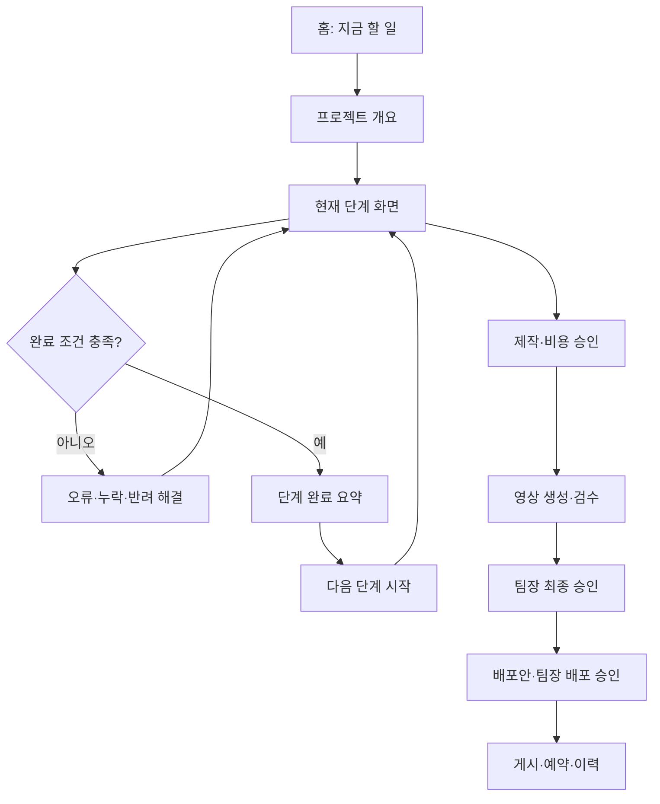

# ③ 화면 구조

- 문서 상태: 확정 v1.0
- 기준 사용자: 콘텐츠 담당자(PC), 콘텐츠 팀장(PC·모바일)
- 핵심 원칙: 전체 파이프라인을 메뉴에 늘어놓지 않고, 프로젝트 안에서 현재 단계와 다음 행동을 중심으로 이동한다.

## 1. 정보 구조

화면은 `전역 업무 영역`과 `프로젝트 단계 영역`으로 분리한다.

### 전역 메뉴

| 메뉴 | 목적 | 콘텐츠 담당자 | 콘텐츠 팀장 |
|---|---|---:|---:|
| 홈 | 지금 할 일, 중단 항목, 승인 대기 확인 | 표시 | 표시 |
| 프로젝트 | 전체 프로젝트 검색·필터·생성 | 편집 가능 | 읽기 중심 |
| 승인함 | 제작·비용, 최종 영상, 배포, 철회 확인 | 제작·비용 승인 | 최종·배포·철회 승인 |
| 배포 일정 | 예약·게시·실패·취소 일정 확인 | 작성·실행 | 확인 |
| 제작 이력 | 비용·버전·검수·승인·성과 조회 | 표시 | 표시 |
| 관리자 | 사용자, 가이드, 연동, 정책, 감사 로그 | 관리자만 | 관리자만 |

콘텐츠 담당자에게는 `새 프로젝트`를 홈과 프로젝트 목록의 가장 눈에 띄는 기본 버튼으로 제공한다. 팀장에게는 `승인 대기`가 첫 기본 행동이다.

### 프로젝트 내부 단계 메뉴

프로젝트 내부에서는 다음 5개 묶음으로 15단계를 보여 준다.

| 묶음 | 포함 단계 |
|---|---|
| 1. 준비 | 입력 검증, 가이드 적용 확인 |
| 2. 기획·연출 | 기획안, 시나리오, 스토리보드 A/B/C 비교 |
| 3. 사전 검수·제작 결정 | 자동 검수, 스토리보드 선택, 제작·비용 승인 |
| 4. 영상 제작·확정 | 영상 생성, 영상 검수, 최종 승인 |
| 5. 배포·기록 | 배포안, 배포 승인, 게시·예약, 제작 이력 |

완료한 묶음은 접고 현재 묶음은 펼친다. 미래 단계는 숨기지 않고 잠금 아이콘과 해제 조건을 함께 표시한다.

## 2. 기본 이동 구조

### 모든 프로젝트 화면의 공통 골격

1. 상단: 프로젝트명, 현재 단계, 전체 진행률, 담당자, 마지막 저장 시각
2. 상태 안내: 현재 상태, 중단 이유, 해야 할 일, 완료 후 열리는 단계
3. 본문: 해당 단계의 입력·산출물·검수·비교·승인 내용
4. 오른쪽 요약 패널: 승인 3종, 검수 결과, 비용·크레딧, 필요한 파일
5. 하단 고정 작업 바: `이전`, `임시 저장`, 현재 단계의 기본 행동, `다음 단계`

오른쪽 요약 패널은 PC에서 고정하고, 모바일에서는 `프로젝트 요약` 접이식 패널로 바꾼다.

## 3. 화면별 구조

| 화면 | 주요 사용자 | 핵심 영역 | 대표 기본 행동 | 완료 후 이동 |
|---|---|---|---|---|
| 대시보드 | 전체 | 지금 할 일, 승인 대기, 멈춘 프로젝트, 마감·배포 일정, 최근 변경 | 역할별 최우선 작업 열기 | 해당 프로젝트 현재 단계 |
| 새 프로젝트 | 콘텐츠 담당자 | 제목, 목적, 담당자, 목표 플랫폼, 희망 길이·비율, 시작 안내 | `프로젝트 만들고 입력 시작` | 입력 검증 |
| 입력 검증 | 콘텐츠 담당자 | 필수 입력 단계형 폼, 실시간 검증, 좋은 예/피해야 할 예, 충돌 요약 | `입력 검증` | 가이드 적용 확인 |
| 가이드 적용 확인 | 콘텐츠 담당자 | 등장 캐릭터별 필수 페이지, 원본 PNG 미리보기, 확인자·버전·시각, 확인 필요 항목 | `원본을 확인하고 적용` | 기획안 |
| 기획안 | 콘텐츠 담당자 | 자동 생성 초안, 필수 섹션, 변경 비교, 가이드 제약, 코멘트 | `기획안 확정` | 시나리오 |
| 시나리오 | 콘텐츠 담당자 | 시간축, 장면 카드, 누적 길이, 캐릭터·말투 경고, 장면 추가·정렬 | `시나리오 확정` | 스토리보드 비교 |
| 스토리보드 A/B/C 비교 | 콘텐츠 담당자 | 3열 비교, 장면 이미지·대사·카메라·타이밍, 차이 요약, 검수 점수 | `이 안 선택` 또는 `자동 검수 시작` | 자동 검수/선택 |
| 자동 검수 | 콘텐츠 담당자 | 종합 판정, 기획·캐릭터·스토리·기술 탭, 근거·원본 위치·수정 제안 | `문제 수정` / `재검수` | 스토리보드 선택 |
| 제작·비용 승인 | 콘텐츠 담당자 | 선택안, 공식 PNG, 프롬프트 검증, 예상 비용·크레딧·클립 수·재생성 상한 | `비용을 확인하고 제작 승인` | 영상 생성 |
| 영상 생성 | 콘텐츠 담당자 | 장면별 생성 상태, 성공 클립 잠금, 실패 원인, 비용 사용량, 전체 결합 상태 | `승인된 영상 생성` / `실패 클립 재시도` | 영상 검수 |
| 영상 검수 | 콘텐츠 담당자 | 영상 재생, 스토리보드 대조, 자동 검수 결과, 실패 장면, 담당자 확인 체크 | `수정 후 재검수` / `팀장 승인 요청` | 최종 승인 |
| 최종 승인 | 콘텐츠 팀장 | 모바일 우선 영상 재생, 검수·수정·비용 요약, 영상 버전·해시, 승인 영향 | `최종 영상 승인` / `수정 요청` | 배포안 |
| 배포안 | 콘텐츠 담당자 | 플랫폼별 계정, 제목·캡션, 공개 범위, 예약 시각(KST), 미리보기 | `배포 승인 요청` | 배포 승인 |
| 배포 승인 | 콘텐츠 팀장 | 영상, 플랫폼·계정·문안·시간 비교, 최종 승인과 별개임을 강조 | `배포 승인` / `수정 요청` | 게시·예약 |
| 게시·예약 | 콘텐츠 담당자 | 플랫폼별 실행 상태, 원격 ID·URL, 재시도·예약 취소, 중복 방지 | `승인된 대상 게시/예약` | 제작 이력 |
| 제작 이력 | 전체 | 타임라인, 버전 계보, 검수·승인, 비용·시간·오류, 게시 성과 | `이력 내보내기` | 프로젝트 개요 |
| 관리자 | 관리자 | 사용자·권한, 가이드·원본, 연동, 비용 정책, 게시 계정, 감사·백업·오류 | 설정별 `변경 저장` | 변경 결과·감사 기록 |

## 4. 화면별 상세 구성

### 4.1 대시보드

콘텐츠 담당자와 팀장의 첫 화면을 다르게 구성한다.

#### 콘텐츠 담당자

1. `지금 할 일` — 현재 진행 가능한 작업 1~3개
2. `진행이 멈춘 항목` — 실패·조건부 통과·비용 초과·연동 오류
3. `내 제작·비용 승인 대기` — 비용 재승인 포함
4. `다가오는 배포 일정`
5. `최근 프로젝트`

#### 콘텐츠 팀장

1. `최종 영상 승인 대기`
2. `배포 승인 대기`
3. `철회 확인 대기`
4. `오늘·이번 주 배포 일정`
5. `최근 승인·반려 이력`

팀장 모바일 홈은 승인 카드에 영상 썸네일, 승인 종류, 프로젝트명, 요청자, 요청 시각, 위험 배지만 보여 주고 한 번의 탭으로 승인 상세로 이동한다.

### 4.2 새 프로젝트와 입력 검증

`새 프로젝트`는 프로젝트 껍데기를 만드는 짧은 화면으로 유지한다. 복잡한 콘텐츠 입력은 생성 후 `입력 검증`에서 단계형으로 받는다.

- 1단계: 무엇을 만들까요? — 주제, 목적, 핵심 상황
- 2단계: 누가 등장하나요? — 공식 캐릭터 선택
- 3단계: 어떻게 보여 줄까요? — 감정, 연출, 길이, 비율
- 4단계: 어디에 게시하나요? — 플랫폼, 일정, 선택 사항
- 5단계: 검토 — 확정/제안/확인 필요 항목과 검증 결과

### 4.3 가이드 적용 확인

캐릭터별로 다음 세 원본을 하나의 확인 카드로 묶는다.

- 소개 페이지
- 턴어라운드 페이지
- 사용 규칙 페이지

각 카드에는 `원본 열기`, `확인한 페이지`, `가이드 버전`, `확인 완료`가 있어야 한다. 여러 캐릭터가 등장하면 세계관·관계도·키 비교 페이지도 필수 카드로 추가한다.

### 4.4 스토리보드 A/B/C 비교

PC에서는 세 안을 같은 스크롤 위치에서 비교한다. 화면 폭이 부족하면 A/B/C 탭과 `차이만 보기`를 제공한다.

- 안별 콘셉트와 예상 감정
- 총 길이, 장면 수, 예상 생성 클립 수
- 자동 검수 결과
- 장면별 이미지, 대사, 카메라, 효과음
- 공식 PNG 연결 상태
- 선택 이유 입력

선택 버튼은 검수 통과 전 잠기며 잠금 이유를 버튼 아래에 표시한다.

### 4.5 세 승인 화면

승인 화면은 공통 구조를 사용하되 제목, 색, 영향 문구와 필수 확인 항목을 다르게 한다.

| 승인 화면 | 가장 먼저 보여 줄 내용 | 승인 결과 |
|---|---|---|
| 제작·비용 승인 | 선택안, 예상 비용·크레딧·클립 수·재생성 상한 | 유료 영상 생성 기능 해제 |
| 최종 영상 승인 | 실제 영상, 검수 결과, 버전·해시, 수정 이력 | 해당 영상만 최종본으로 확정 |
| 배포 승인 | 플랫폼·계정·문안·공개 범위·예약 시각 | 승인 범위 내 게시·예약 기능 해제 |

팀장 모바일 승인 화면은 `요약 → 실제 결과 확인 → 필수 체크 → 승인/수정 요청` 순서를 강제한다. 승인 버튼은 영상 재생 및 필수 체크 전에는 잠긴다.

### 4.6 제작 이력

기본은 시간순 타임라인으로 보여 주고 다음 필터를 제공한다.

- 산출물 생성·수정
- 자동 검수와 담당자 확인
- 제작·비용, 최종 영상, 배포, 철회 승인
- 크레딧·비용·재생성
- 게시·예약·취소·실패
- 사용자·권한·연동 변경

`무엇이`, `누구에 의해`, `언제`, `어떤 버전에서`, `왜`, `무엇으로 바뀌었는지`를 한 이벤트에 기록한다.

### 4.7 관리자 화면

한 화면 안의 탭으로 구성한다.

1. 사용자·역할
2. 공식 가이드·원본 버전
3. 파일 저장소·영상 생성·자동 검수 연동
4. 게시 플랫폼·계정
5. 비용·크레딧 정책
6. 감사 로그
7. 백업·복구
8. 오류·모니터링

위험한 변경은 영향 범위, 중단 가능 단계, 복구 방법과 변경 사유를 먼저 보여 준다.

## 5. 초보자가 길을 잃지 않게 하는 이동 규칙

1. 로그인 후 역할에 따라 가장 중요한 할 일을 첫 카드로 보여 준다.
2. 프로젝트를 열면 목록 화면이 아니라 `현재 단계`로 바로 이동한다.
3. 과거 단계는 열람 가능하고, 편집하면 무효화될 하위 결과를 먼저 알려 준다.
4. 미래 단계는 보이지만 잠겨 있으며 해제 조건을 표시한다.
5. 화면마다 강조된 기본 행동은 하나만 둔다.
6. 단계 완료 시 즉시 이동시키지 않고 `결과물·결정 사항·다음 입력값` 요약을 먼저 보여 준다.
7. 반려 알림은 반려 사유가 있는 화면과 수정할 필드로 바로 연결한다.
8. 검수 실패는 단순히 이전 화면으로 보내지 않고 실패 근거와 수정 제안을 함께 유지한다.
9. 승인 요청자는 대기 상태와 승인 담당자, 요청 시각을 확인할 수 있다.
10. 권한이 없는 사용자는 버튼을 숨기기보다 읽기 전용으로 보여 주고 담당자를 안내한다.

## 6. 경로 제안

| 경로 | 화면 |
|---|---|
| `/` | 역할별 대시보드 |
| `/projects` | 프로젝트 목록 |
| `/projects/new` | 새 프로젝트 |
| `/projects/:id` | 프로젝트 개요·현재 단계 이동 |
| `/projects/:id/input` | 입력 검증 |
| `/projects/:id/guide` | 가이드 적용 확인 |
| `/projects/:id/plan` | 기획안 |
| `/projects/:id/scenario` | 시나리오 |
| `/projects/:id/storyboards` | 스토리보드 A/B/C 비교·선택 |
| `/projects/:id/planning-review` | 자동 검수 |
| `/projects/:id/production-approval` | 제작·비용 승인 |
| `/projects/:id/video-generation` | 영상 생성 |
| `/projects/:id/video-review` | 영상 검수 |
| `/projects/:id/final-approval` | 최종 승인 |
| `/projects/:id/distribution-plan` | 배포안 |
| `/projects/:id/distribution-approval` | 배포 승인 |
| `/projects/:id/publication` | 게시·예약 |
| `/projects/:id/history` | 제작 이력 |
| `/approvals` | 역할별 승인함 |
| `/calendar` | 배포 일정 |
| `/admin` | 관리자 화면 |

## 7. 확정·제안 구분

### 확정 사항

- 콘텐츠 담당자는 PC 중심의 전체 제작 흐름을 사용한다.
- 콘텐츠 팀장은 PC·모바일에서 최종 영상·배포·철회 승인을 처리한다.
- 홈은 역할별 지금 할 일과 승인 대기를 우선한다.
- 세 승인 화면과 기록은 서로 분리한다.
- 프로젝트 화면마다 현재 단계, 다음 행동, 담당자, 승인·검수·비용·파일 상태를 보여 준다.

### 설계 제안

- 전역 메뉴는 6개로 제한하고 세부 제작 단계는 프로젝트 내부에 둔다.
- 15단계를 5개 묶음으로 접어 초보자의 인지 부담을 줄인다.
- 팀장 승인 화면은 모바일 전용 요약 흐름을 제공한다.
- 프로젝트를 열면 개요가 아니라 현재 작업 단계로 바로 이동한다.
