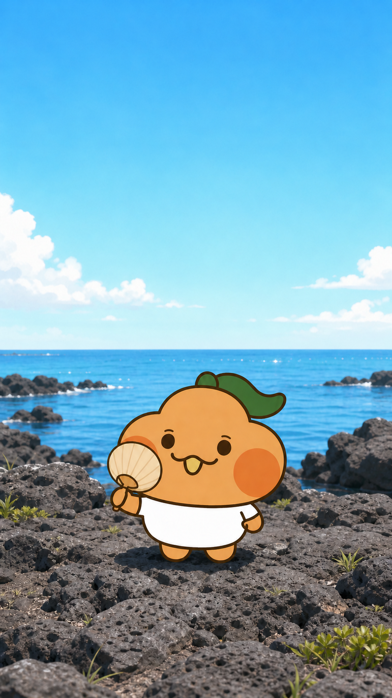
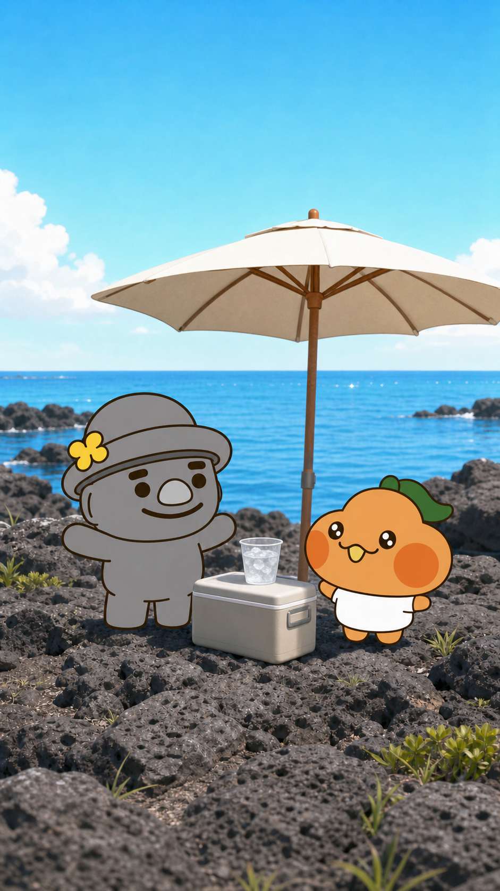
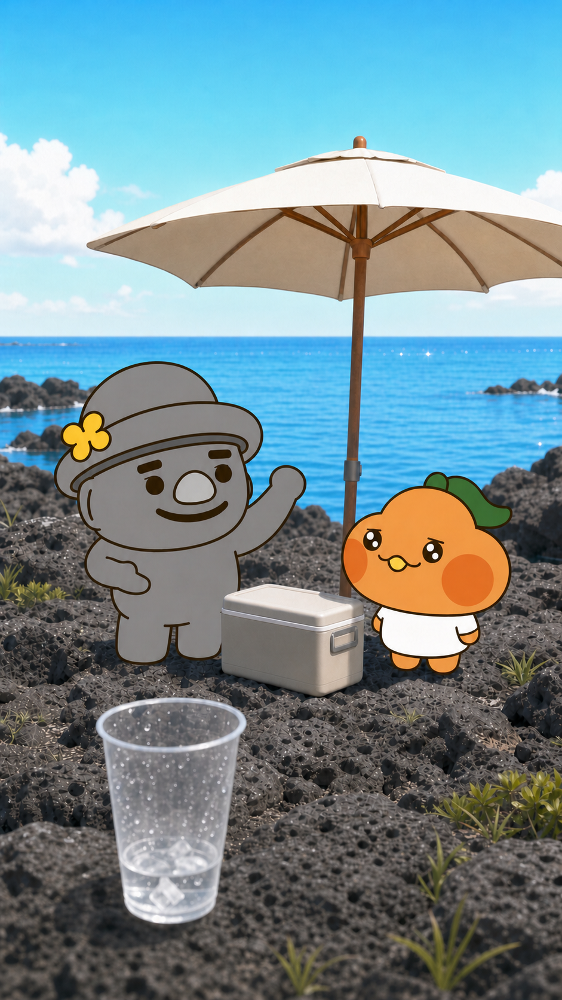
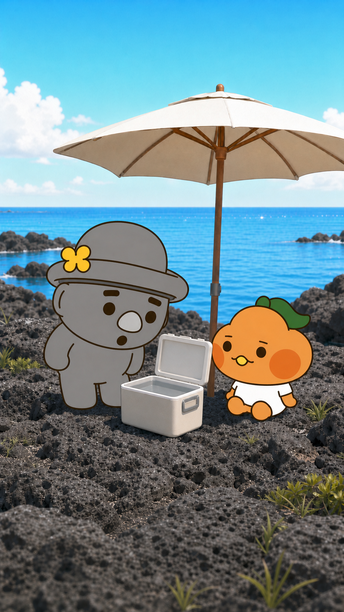
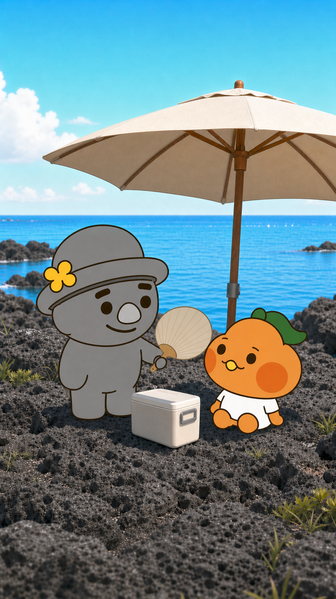

# 스토리보드 A안 — 기본형

## 연출 방향

- 연출 콘셉트: 이야기와 캐릭터 관계를 한눈에 이해할 수 있는 안정적 연출
- 목표 감정: 편안함, 명확한 상황 전달, 따뜻한 웃음
- 총 길이: 30초
- 장면 수: 5
- 오디오: 없음

| 장면 | 시간 | 화면 구성 | 캐릭터 행동·표정 | 대사·자막 | 카메라 | 효과음·음악 | 생성 프롬프트 |
|---|---:|---|---|---|---|---|---|
| 1 | 0~5초 | 제주 현무암 해안과 뜨거운 하늘 | 부라봉이 부채를 들고 더위에 지친다. 공식 크기의 정원 눈과 3자 입을 유지한다. | `"라봉이는 여름이 싫다봉…"` / 상단 중앙 | 정면 미디엄 클로즈업, 느린 줌인 | 없음 | 공식 부라봉 외형, 뜨거운 제주 바다, 정면 안정 구도, 상단 자막 여백, 글자·로고 없음 |
| 2 | 5~11초 | 파라솔·아이스박스·얼음물 피서 자리 | 고르방이 준비물을 자랑한다. 부라봉은 반짝이는 눈으로 바라본다. 고르방이 더 크다. | `"자, 라봉아. 내가 완벽한 여름휴가 계획을 준비했는데…"` / 하단 중앙 | 두 캐릭터 정면 풀샷 | 없음 | 공식 고르방·부라봉, 키 비례 유지, 평범한 무브랜드 피서 소품, 정면 풀샷, 글자 없음 |
| 3 | 11~20초 | 같은 자리, 녹아가는 얼음컵 전경 | 고르방은 둥글고 뭉툭한 손으로 설명하고 부라봉은 점차 지친다. | 고르방의 긴 설명을 2줄씩 순차 표시 | 안정적인 미디엄샷, 얼음컵 전경 | 없음 | 공식 두 캐릭터, 고르방 수다 제스처, 부라봉 공식 눈 크기 유지, 녹는 얼음 전경, 글자 없음 |
| 4 | 20~25초 | 물만 남은 열린 아이스박스 | 부라봉은 앉아 고르방을 바라보고, 고르방은 부드럽게 당황한다. | `"설명하다 다 녹았다봉!"` / 중앙 하단 | 아이스박스 중심 미디엄샷 | 없음 | 공식 두 캐릭터, 물만 남은 무브랜드 아이스박스, 부라봉 앉은 자세, 고르방의 둥근 눈썹과 뭉툭한 손발 |
| 5 | 25~30초 | 파라솔 그늘과 제주 바다 | 고르방이 부라봉을 부채질한다. 부라봉이 밝게 웃는다. | `"말보다 시원한 여름휴가다봉!"` / 상단 중앙 | 안정적인 미디엄 와이드샷 | 없음 | 공식 두 캐릭터, 고르방이 더 크게, 그늘 아래 부채질, 따뜻한 가족 엔딩, 글자·로고 없음 |

## 장면별 이미지 보드

### 장면 1 · 00:00~00:05

- **스토리:** 여름과 더위에 약한 부라봉의 문제를 첫 장면에서 바로 제시한다.
- **화면:** 뜨거운 제주 현무암 해안과 넓은 하늘.
- **캐릭터:** 부라봉 단독. 공식 실루엣·잎·볼·흰 하의를 유지한다.
- **대사·자막:** “라봉이는 여름이 싫다봉…” / 상단 중앙.
- **카메라:** 정면 미디엄 클로즈업에서 느린 줌인.
- **효과음·음악:** 없음.
- **영상 생성 프롬프트:** 공식 부라봉 외형을 고정한 채 부채를 천천히 움직이고, 카메라는 매우 느리게 전진한다. 잎·볼·눈·입·신체 비율을 바꾸지 않는다. `sound=off`.
- **이미지 생성 기록:** 공식 p08·p09·p10 참조, OpenAI built-in image generation.

### 장면 2 · 00:05~00:11

- **스토리:** 고르방이 든든한 조력자로 등장해 해결책을 보여준다.
- **화면:** 파라솔 아래 아이스박스와 얼음물.
- **캐릭터:** 고르방이 부라봉보다 크다. 두 캐릭터의 공식 장식과 비율을 유지한다.
- **대사·자막:** “자, 라봉아. 내가 완벽한 여름휴가 계획을 준비했는데…” / 하단 중앙.
- **카메라:** 정면 풀샷, 미세한 틸트업.
- **효과음·음악:** 없음.
- **영상 생성 프롬프트:** 고르방이 둥글고 뭉툭한 팔을 펼치고 부라봉이 반짝이는 공식 눈으로 준비물을 본다. 파라솔과 소품은 고정하고 캐릭터 형태를 흔들지 않는다. `sound=off`.
- **이미지 생성 기록:** 공식 p09·p10·p12·p13 및 직전 승인 이미지 참조, OpenAI built-in image generation.

### 장면 3 · 00:11~00:20

- **스토리:** 고르방의 수다가 이어지는 동안 해결책이 사라지는 원인을 시각화한다.
- **화면:** 고르방과 부라봉 사이에 아이스박스, 전경에 녹는 얼음컵.
- **캐릭터:** 고르방은 둥근 손짓으로 설명하고 부라봉은 공식 눈 크기를 유지한 채 지친다.
- **대사·자막:** 고르방의 긴 설명을 두 줄씩 순차 표시.
- **카메라:** 미디엄샷에서 컵으로 포커스 이동.
- **효과음·음악:** 없음.
- **영상 생성 프롬프트:** 고르방은 뾰족한 손가락 없이 둥근 팔 끝으로만 설명한다. 부라봉 표정 변화는 눈 크기와 3자 입 형태를 유지한다. 얼음만 천천히 작아진다. `sound=off`.
- **이미지 생성 기록:** 공식 p09·p10·p12·p13 및 직전 승인 이미지 참조, OpenAI built-in image generation. 길게 생성된 고르방 손끝을 둥근 공식 형태로 수정함.

### 장면 4 · 00:20~00:25

- **스토리:** 아이스박스에 물만 남아 반전이 완성된다.
- **화면:** 열린 아이스박스가 중앙에 있고 두 캐릭터가 양옆에서 바라본다.
- **캐릭터:** 앉은 부라봉과 부드럽게 당황한 고르방.
- **대사·자막:** “설명하다 다 녹았다봉!” / 중앙 하단.
- **카메라:** 아이스박스에서 부라봉 얼굴로 짧게 컷.
- **효과음·음악:** 없음.
- **영상 생성 프롬프트:** 아이스박스 뚜껑이 열리고 얕은 물만 보인다. 부라봉과 고르방은 공식 외형을 유지하며 크게 움직이지 않는다. `sound=off`.
- **이미지 생성 기록:** 공식 p09·p10·p12·p13 및 직전 승인 이미지 참조, OpenAI built-in image generation.

### 장면 5 · 00:25~00:30

- **스토리:** 고르방이 수다를 멈추고 행동으로 부라봉을 돌보며 마무리한다.
- **화면:** 파라솔 그늘, 닫힌 아이스박스, 제주 바다.
- **캐릭터:** 고르방이 부라봉을 천천히 부채질하고 부라봉이 웃는다.
- **대사·자막:** “말보다 시원한 여름휴가다봉!” / 상단 중앙.
- **카메라:** 안정적인 정면 미디엄 와이드샷.
- **효과음·음악:** 없음.
- **영상 생성 프롬프트:** 고르방이 뭉툭한 손으로 부채를 작게 왕복하고 부라봉의 잎이 미세하게 흔들린다. 두 캐릭터의 얼굴·신체 비율과 고유 장식을 고정한다. `sound=off`.
- **이미지 생성 기록:** 공식 p09·p10·p12·p13 및 직전 승인 이미지 참조, OpenAI built-in image generation.
