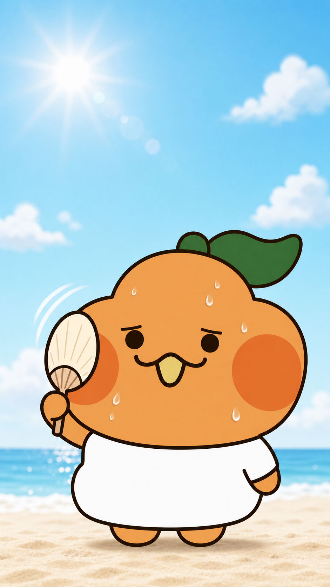
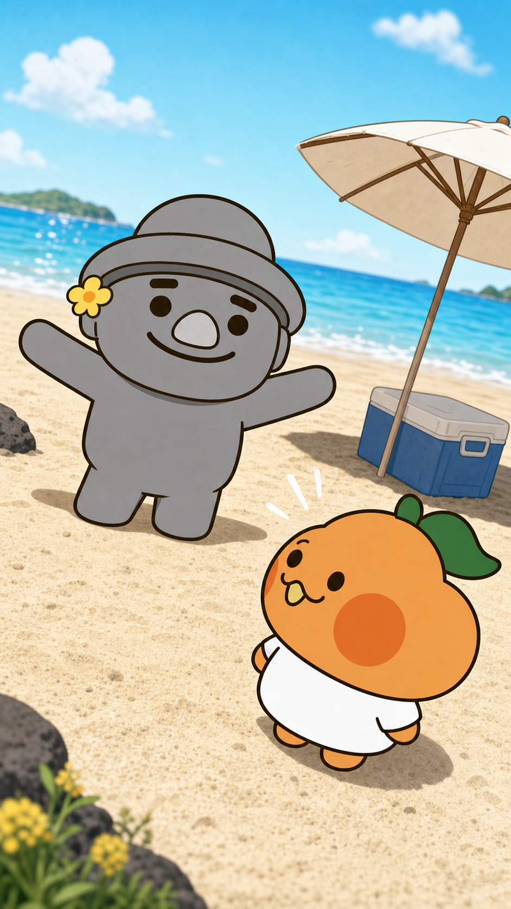
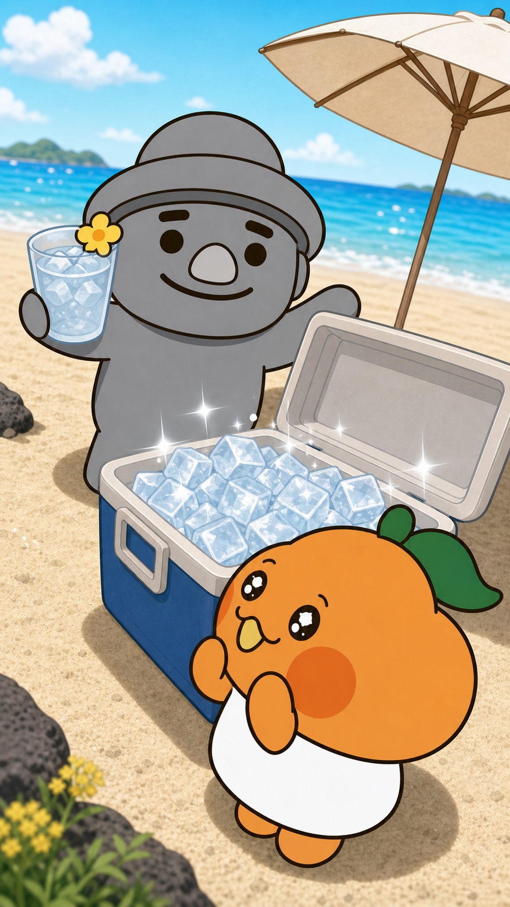
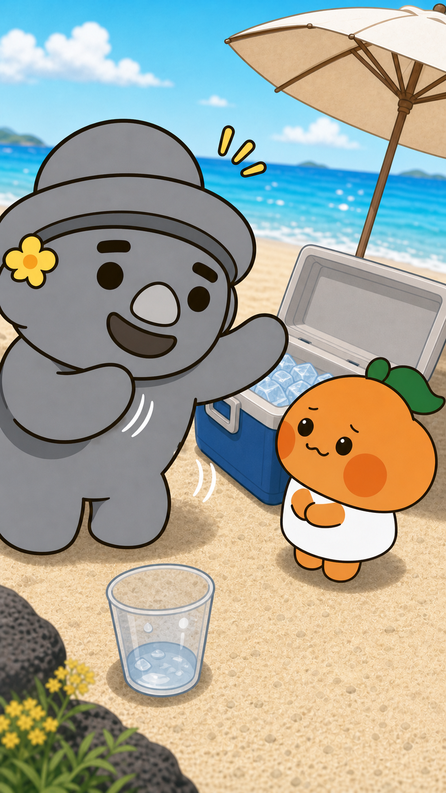
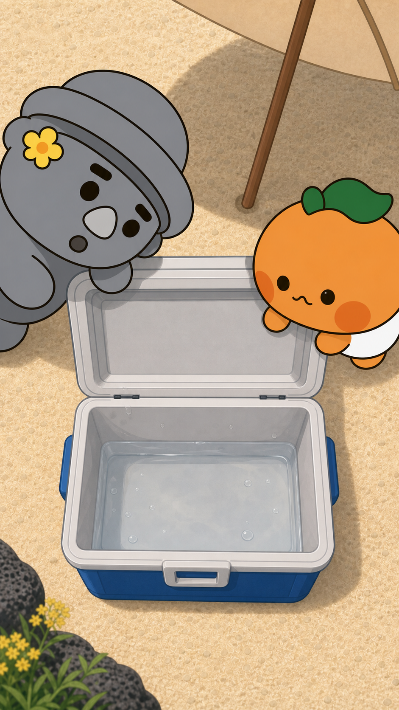
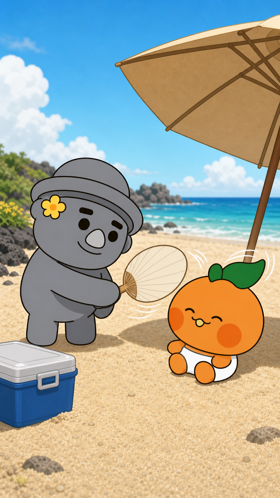

# 스토리보드 B안 — 코미디형

## 연출 방향

- 연출 콘셉트: 과감한 구도 변화와 빠른 타이밍으로 반전을 강조하는 무음 코미디
- 목표 감정: 즉각적인 웃음, 기대 상승, 빠른 반전
- 총 길이: 30초
- 장면 수: 6
- 오디오: 없음

| 장면 | 시간 | 화면 구성 | 캐릭터 행동·표정 | 대사·자막 | 카메라 | 효과음·음악 | 생성 프롬프트 |
|---|---:|---|---|---|---|---|---|
| 1 | 0~3초 | 뜨거운 하늘과 부라봉 얼굴 | 부라봉이 빠르게 부채질한다. | `"여름… 너무 덥다봉!"` / 상단 | 로우앵글 극근접 | 없음 | 공식 부라봉 극근접, 잎과 하의까지 안전 영역, 정원 눈과 3자 입 유지 |
| 2 | 3~7초 | 파라솔과 아이스박스를 배경으로 고르방 등장 | 고르방이 영웅처럼 팔을 펼친다. 부라봉이 돌아본다. | `"걱정 마, 라봉아!"` / 하단 | 더치앵글 로우샷 | 없음 | 공식 두 캐릭터, 고르방이 더 크게, 역동적 대각선, 무브랜드 소품 |
| 3 | 7~12초 | 얼음이 가득한 아이스박스 | 부라봉의 반짝이는 눈, 고르방의 자랑스러운 표정 | `"완벽한 피서 준비 완료!"` / 하단 | 탑뷰 3/4 | 없음 | 아이스박스 중심 탑뷰, 공식 반짝이는 눈, 고유 요소 유지 |
| 4 | 12~20초 | 고르방 전경·부라봉 후경·녹는 컵 | 고르방은 계속 설명하고 부라봉은 팔짱을 낀다. | 긴 설명 자막을 빠르게 교체 | 오버숄더, 컵 포커스 | 없음 | 둥근 팔 끝의 고르방 수다, 공식 눈 크기의 지친 부라봉, 녹는 얼음컵 |
| 5 | 20~25초 | 물만 남은 아이스박스 | 두 캐릭터가 위에서 들여다본다. | `"…다 녹았다봉."` / 중앙 | 수직 탑샷 | 없음 | 물만 남은 아이스박스 중앙, 두 얼굴이 모서리에서 내려다보는 구도 |
| 6 | 25~30초 | 파라솔 아래 부채질 | 고르방이 빠르게 부채질하고 부라봉은 활짝 웃는다. | `"이게 진짜 피서다봉!"` / 상단 | 매우 낮은 미디엄 와이드샷 | 없음 | 공식 두 캐릭터, 키 비례, 부채 바람에 잎이 미세하게 흔들림, 따뜻한 엔딩 |

## 장면별 이미지 보드

### 장면 1 · 00:00~00:03

- **스토리:** 부라봉의 더위 취약점을 극근접으로 즉시 각인한다.
- **화면:** 뜨거운 하늘과 바다를 단순화한 배경.
- **캐릭터:** 부라봉 단독, 공식 눈·입·잎·볼·흰 하의 유지.
- **대사·자막:** “여름… 너무 덥다봉!” / 상단.
- **카메라:** 로우앵글 극근접에서 짧은 흔들림.
- **효과음·음악:** 없음.
- **영상 생성 프롬프트:** 공식 부라봉이 부채를 빠르게 왕복하되 신체는 고정한다. 잎·볼·눈·입 크기를 유지하고 자막은 후편집한다. `sound=off`.
- **이미지 생성 기록:** 공식 p08·p09·p10 참조, OpenAI built-in image generation. 잎이 잘리지 않도록 프레이밍을 수정함.

### 장면 2 · 00:03~00:07

- **스토리:** 고르방의 과장된 등장으로 기대를 빠르게 끌어올린다.
- **화면:** 기울어진 수평선, 파라솔과 아이스박스.
- **캐릭터:** 고르방이 크게 팔을 펼치고 부라봉이 올려다본다.
- **대사·자막:** “걱정 마, 라봉아!” / 하단.
- **카메라:** 더치앵글 로우샷, 빠른 팬.
- **효과음·음악:** 없음.
- **영상 생성 프롬프트:** 고르방이 둥글고 뭉툭한 팔 끝을 펼치며 등장한다. 부라봉은 키 비례상 더 작다. 모든 캐릭터 요소를 고정한다. `sound=off`.
- **이미지 생성 기록:** 공식 p09·p10·p12·p13 및 B1 참조, OpenAI built-in image generation.

### 장면 3 · 00:07~00:12

- **스토리:** 얼음이 가득한 모습을 과장해 뒤의 반전을 준비한다.
- **화면:** 아이스박스와 얼음컵이 중심인 3/4 탑뷰.
- **캐릭터:** 부라봉은 공식 반짝이는 눈, 고르방은 자랑스러운 웃음.
- **대사·자막:** “완벽한 피서 준비 완료!” / 하단.
- **카메라:** 빠른 줌인 후 0.5초 정지.
- **효과음·음악:** 없음.
- **영상 생성 프롬프트:** 얼음 반짝임만 약하게 움직이고 캐릭터는 공식 외형을 유지한다. 반짝이는 눈은 공식 허용 크기만 사용한다. `sound=off`.
- **이미지 생성 기록:** 공식 p09·p10·p12·p13 및 B2 참조, OpenAI built-in image generation.

### 장면 4 · 00:12~00:20

- **스토리:** 고르방의 수다와 녹는 얼음을 한 화면에서 충돌시킨다.
- **화면:** 고르방 전경, 부라봉 후경, 녹는 얼음컵 최전경.
- **캐릭터:** 고르방은 둥근 팔 끝으로 빠르게 설명하고 부라봉은 공식 눈 크기를 유지한다.
- **대사·자막:** 긴 설명을 1.5초 간격으로 교체.
- **카메라:** 오버숄더와 컵 랙포커스.
- **효과음·음악:** 없음.
- **영상 생성 프롬프트:** 고르방의 손은 뾰족해지지 않게 작은 범위로 움직인다. 컵의 얼음만 빠르게 작아지고 부라봉은 점점 지친다. `sound=off`.
- **이미지 생성 기록:** 공식 p09·p10·p12·p13 및 B3 참조, OpenAI built-in image generation.

### 장면 5 · 00:20~00:25

- **스토리:** 물만 남은 아이스박스를 수직 탑샷으로 보여주며 무음 반전을 만든다.
- **화면:** 중앙의 아이스박스와 양쪽 모서리의 두 얼굴.
- **캐릭터:** 고르방의 꽃·모자와 부라봉의 잎·볼을 모두 보이게 한다.
- **대사·자막:** “…다 녹았다봉.” / 중앙.
- **카메라:** 수직 탑샷, 짧은 정지.
- **효과음·음악:** 없음.
- **영상 생성 프롬프트:** 카메라는 고정하고 얕은 물결만 한 번 흔들린다. 두 캐릭터의 얼굴 요소는 변형하지 않는다. `sound=off`.
- **이미지 생성 기록:** 공식 p09·p10·p12·p13 및 B4 참조, OpenAI built-in image generation.

### 장면 6 · 00:25~00:30

- **스토리:** 고르방이 설명을 멈추고 직접 부채질해 빠르게 웃음과 온기를 회수한다.
- **화면:** 파라솔 그늘과 제주 바다.
- **캐릭터:** 고르방은 부라봉보다 크고, 부라봉은 앉아 공식 웃는 표정을 짓는다.
- **대사·자막:** “이게 진짜 피서다봉!” / 상단.
- **카메라:** 매우 낮은 미디엄 와이드샷.
- **효과음·음악:** 없음.
- **영상 생성 프롬프트:** 고르방의 부채만 빠르게 왕복하고 부라봉의 잎은 형태를 유지한 채 미세하게 움직인다. 캐릭터 비율과 장식을 고정한다. `sound=off`.
- **이미지 생성 기록:** 공식 p09·p10·p12·p13 및 B5 참조, OpenAI built-in image generation.
