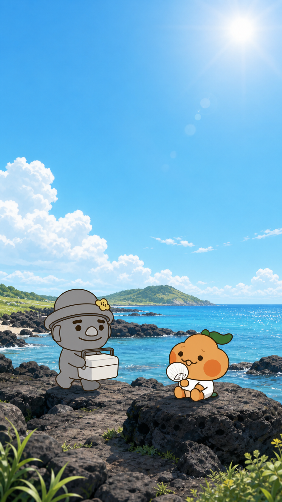
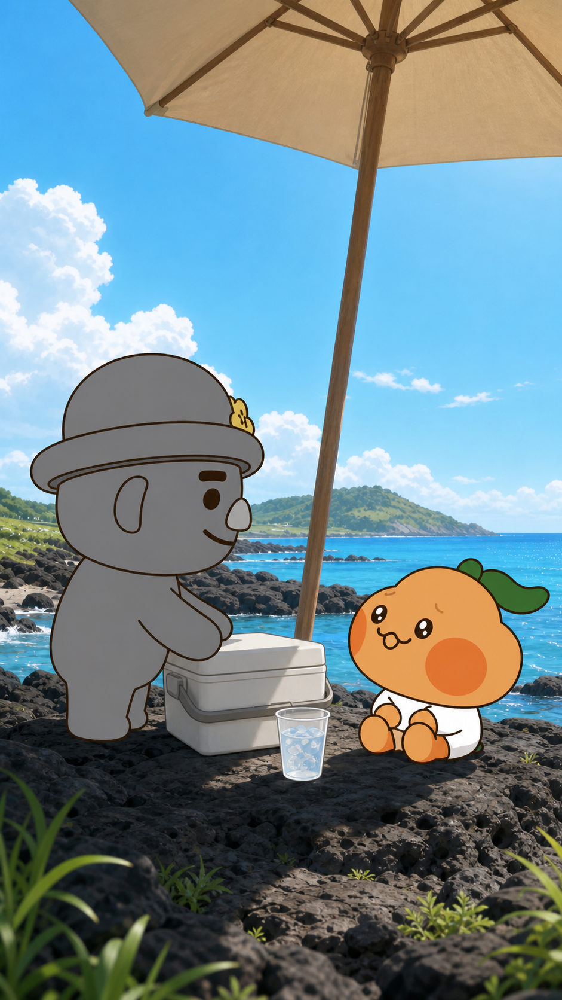
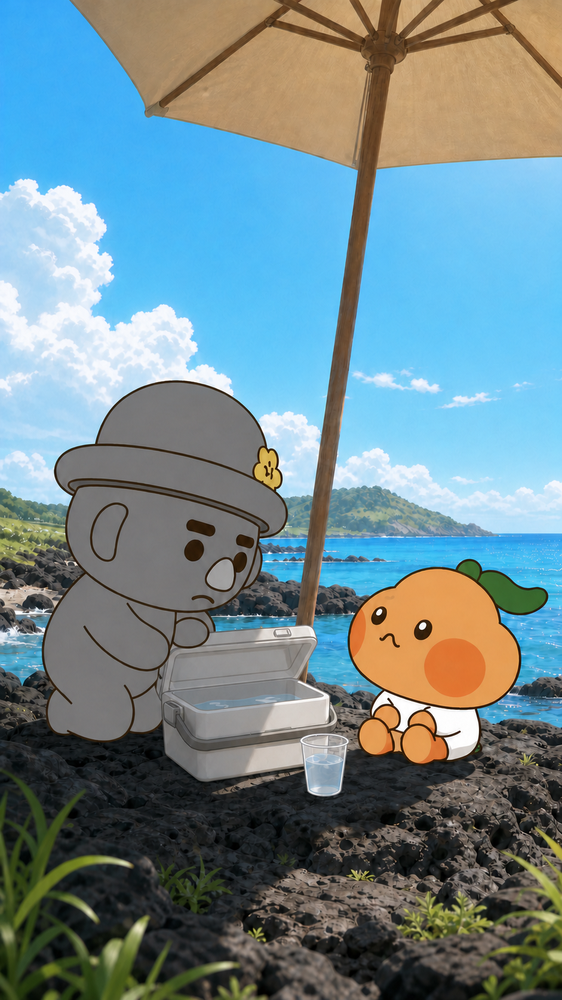
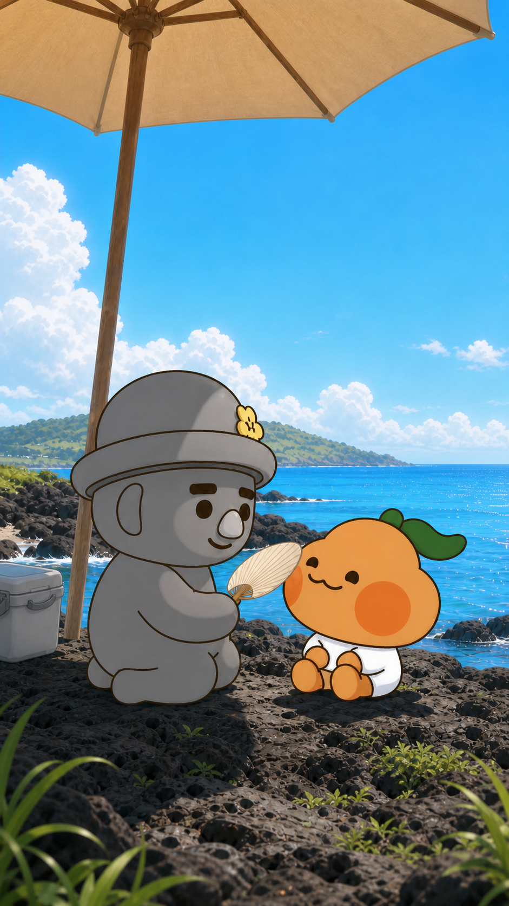

# 스토리보드 C안 — 감성형

## 연출 방향

- 연출 콘셉트: 제주 풍경과 부라봉·고르방의 다정한 관계를 여백 있게 보여주는 감성 연출
- 목표 감정: 여름의 공기, 배려, 가족의 따뜻함
- 총 길이: 30초
- 장면 수: 4
- 오디오: 없음

| 장면 | 시간 | 화면 구성 | 캐릭터 행동·표정 | 대사·자막 | 카메라 | 효과음·음악 | 생성 프롬프트 |
|---|---:|---|---|---|---|---|---|
| 1 | 0~7초 | 넓은 제주 바다와 현무암 | 부라봉은 바위에 앉아 더워하고, 고르방이 아이스박스를 들고 다가온다. | `"더운 날에도, 함께라면."` / 상단 | 환경 와이드샷, 느린 팬 | 없음 | 공식 두 캐릭터를 하단 1/3에 배치, 넓은 제주 풍경, 키 비례 유지 |
| 2 | 7~15초 | 파라솔 그늘과 피서 자리 | 고르방이 준비를 마치고 부라봉을 바라본다. 부라봉은 반짝이는 눈으로 올려다본다. | `"라봉아, 시원하게 쉬자."` / 하단 | 측면 미디엄 투샷 | 없음 | 공식 측면 실루엣, 고르방 모자 뒤 기울기, 부라봉 공식 반짝이는 눈 |
| 3 | 15~23초 | 물만 남은 아이스박스와 두 캐릭터 | 고르방은 미안해하고 부라봉은 화내지 않고 바라본다. | `"설명은 녹았지만…"` / 상단 | 눈높이 정적 투샷 | 없음 | 공식 두 캐릭터가 열린 아이스박스를 사이에 두고 마주보는 조용한 장면 |
| 4 | 23~30초 | 그늘 아래 바다를 마주한 두 캐릭터 | 고르방이 부채질하고 부라봉이 웃는다. | `"마음은 더 시원해졌다봉."` / 상단 | 3/4 미디엄 와이드, 느린 줌아웃 | 없음 | 공식 두 캐릭터의 다정한 엔딩, 바다 수평선, 캐릭터·소품 연속성 유지 |

## 장면별 이미지 보드

### 장면 1 · 00:00~00:07

- **스토리:** 넓은 제주 풍경 속에서 더위에 지친 부라봉과 그를 챙기러 오는 고르방을 소개한다.
- **화면:** 검은 현무암, 푸른 바다, 높은 여름 하늘.
- **캐릭터:** 부라봉은 바위에 앉아 있고 고르방은 아이스박스를 들고 다가온다.
- **대사·자막:** “더운 날에도, 함께라면.” / 상단.
- **카메라:** 매우 넓은 환경샷에서 천천히 오른쪽 팬.
- **효과음·음악:** 없음.
- **영상 생성 프롬프트:** 제주 바다의 잔잔한 빛과 구름만 천천히 움직인다. 고르방은 부라봉보다 큰 공식 비례로 다가오고 모든 고유 장식을 유지한다. `sound=off`.
- **이미지 생성 기록:** 공식 p07·p09·p10·p12·p13 참조, OpenAI built-in image generation.

### 장면 2 · 00:07~00:15

- **스토리:** 고르방의 피서 준비를 해결책보다 돌봄의 행동으로 보여준다.
- **화면:** 파라솔 그늘, 아이스박스, 얼음물, 제주 바다.
- **캐릭터:** 고르방은 공식 측면 모자 기울기와 귀·코 위치를 유지하고, 부라봉은 반짝이는 공식 눈으로 올려다본다.
- **대사·자막:** “라봉아, 시원하게 쉬자.” / 하단.
- **카메라:** 측면 미디엄 투샷, 느린 전진.
- **효과음·음악:** 없음.
- **영상 생성 프롬프트:** 두 캐릭터는 작은 시선 움직임만 보이고, 바다와 파라솔 천이 미세하게 움직인다. 외형·비율·소품 위치를 고정한다. `sound=off`.
- **이미지 생성 기록:** 공식 p09·p10·p12·p13 및 C1 참조, OpenAI built-in image generation.

### 장면 3 · 00:15~00:23

- **스토리:** 얼음이 녹은 실수를 크게 웃기기보다 두 캐릭터가 서로를 이해하는 정적인 순간으로 표현한다.
- **화면:** 물만 남은 열린 아이스박스와 두 캐릭터.
- **캐릭터:** 고르방은 부드럽게 미안해하고, 부라봉은 공식 눈·입 형태를 유지한 채 바라본다.
- **대사·자막:** “설명은 녹았지만…” / 상단.
- **카메라:** 눈높이 정적 투샷.
- **효과음·음악:** 없음.
- **영상 생성 프롬프트:** 아이스박스 물결만 미세하게 흔들리고 두 캐릭터는 시선만 교환한다. 부라봉의 3자 입과 고르방의 둥근 눈썹·손발을 유지한다. `sound=off`.
- **이미지 생성 기록:** 공식 p09·p10·p12·p13 및 C2 참조, OpenAI built-in image generation. 부라봉 입 형태를 공식 규칙에 맞춰 보정함.

### 장면 4 · 00:23~00:30

- **스토리:** 고르방이 말보다 행동으로 부라봉을 돌보며 감성적으로 끝낸다.
- **화면:** 파라솔 그늘과 넓은 제주 바다.
- **캐릭터:** 고르방이 부라봉을 부채질하고 부라봉이 올려다보며 웃는다.
- **대사·자막:** “마음은 더 시원해졌다봉.” / 상단.
- **카메라:** 3/4 미디엄 와이드에서 천천히 줌아웃.
- **효과음·음악:** 없음.
- **영상 생성 프롬프트:** 고르방의 부채와 부라봉의 잎만 작게 움직이고 카메라가 천천히 멀어진다. 두 캐릭터의 공식 외형과 키 비례를 끝까지 고정한다. `sound=off`.
- **이미지 생성 기록:** 공식 p09·p10·p12·p13 및 C3 참조, OpenAI built-in image generation.
