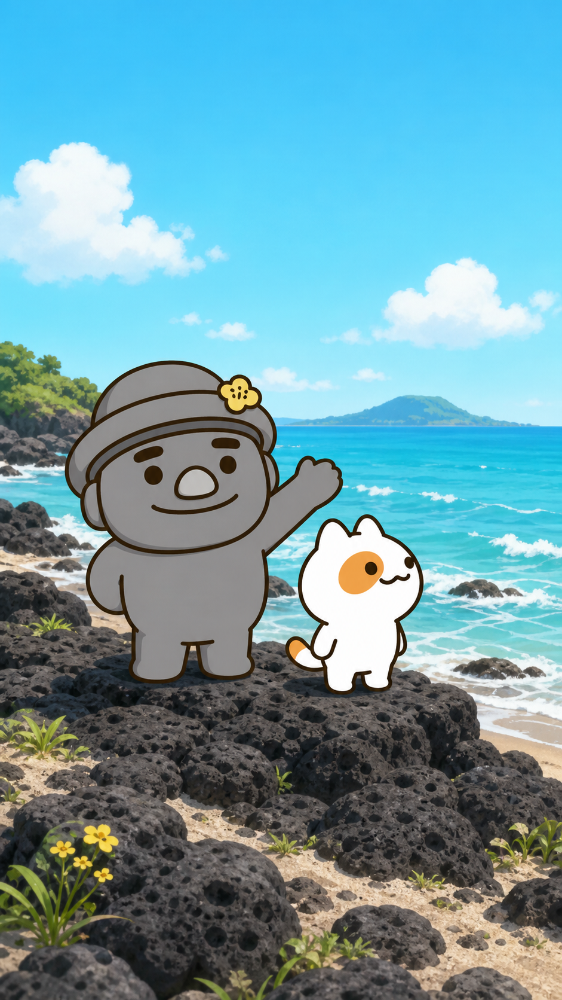
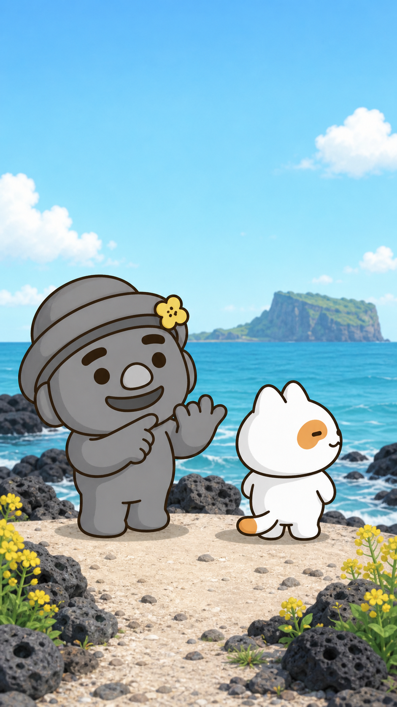
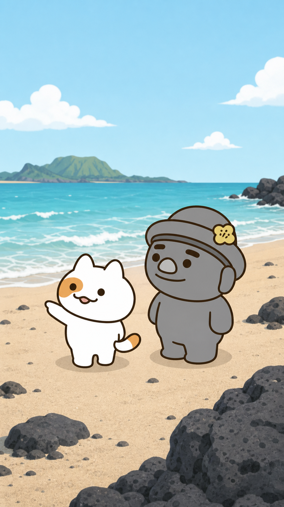
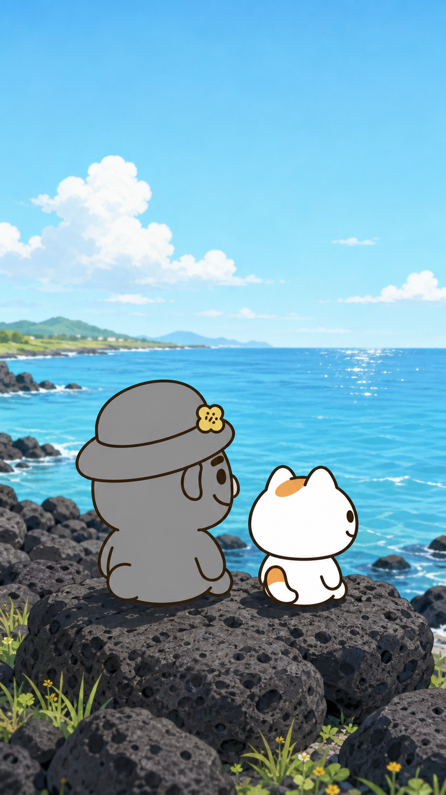

# 스토리보드 A안 — 기본형

## 연출 방향

- 연출 콘셉트: 캐릭터와 대사가 명확하게 전달되는 안정적 연출
- 목표 감정: 편안함, 이해 용이
- 총 길이: 30초
- 장면 수: 4

| 장면 | 시간 | 화면 구성 | 캐릭터 행동·표정 | 대사·자막 | 카메라 | 효과음·음악 | 생성 프롬프트 |
|---|---:|---|---|---|---|---|---|
| 1 | 0~5초 | 제주 바다와 현무암을 배경으로 두 캐릭터가 중앙에 선다. | 고르방은 손을 들고 인자하게 웃고, 냥냥이는 편안히 파도를 본다. | 고르방 “자, 여름 휴가의 첫 순서는 말이지…” / 제목 자막 | 안정된 와이드 정면 샷 | 파도·바람 / 가벼운 연주 | 공식 고르방·냥냥이 레퍼런스와 동일한 외형. 세로 9:16, 제주 검은 현무암 해안, 맑은 여름 하늘, 두 캐릭터 전신, 고르방이 더 크게, 텍스트·로고·워터마크 없음. |
| 2 | 5~13초 | 고르방 중심의 중간 샷, 냥냥이는 옆에서 바다를 본다. | 고르방이 손가락을 세며 수다를 이어가고 냥냥이는 살짝 눈을 가늘게 뜬다. | 고르방 “바다 보고, 바람 쐬고, 파도 소리도 분석하고…” | 미디엄 정면 샷 | 톡톡·파도 / 잔잔한 연주 | 동일한 공식 외형과 해안 연속성. 고르방의 뒤로 기운 모자·노란 유채꽃, 둥근 눈썹과 뭉툭한 손발 유지. 냥냥이 좌측 눈 주황 반점·꼬리 끝 1/5 주황 무늬 유지. 텍스트 없음. |
| 3 | 13~22초 | 냥냥이와 파도를 중심에 둔다. | 냥냥이가 파도를 가리키고 고르방은 수다를 멈추어 귀 기울인다. | 냥냥이 “조용한 게 제일이다냥.” | 3/4 미디엄 샷 | 파도만 남기는 정적 | 동일한 공식 외형. 냥냥이의 눈 반점은 화면 기준 좌측, 좌우 반전 금지. 고르방은 냥냥이보다 큰 키. 현무암과 잔잔한 파도, 부드러운 낮빛, 텍스트·말풍선 없음. |
| 4 | 22~30초 | 두 캐릭터가 현무암 위에서 바다를 본다. | 함께 앉아 편안한 미소를 짓는다. | 고르방 “그래, 쉼표 같은 휴가구나.” / “함께 쉬는 여름” | 뒤쪽 3/4 와이드 샷 | 파도·바람 / 낮게 잦아드는 연주 | 동일한 공식 외형과 캐릭터 비례. 밝은 낮의 제주 바다, 두 캐릭터가 나란히 앉아 있음, 고르방이 더 큼, 새 의상·소품 없음, 텍스트·로고·워터마크 없음. |

## 장면별 이미지 보드

### 장면 1 · 00:00~00:05

- 스토리: 고르방과 냥냥이가 바다에 도착한다.
- 이미지 생성 기록: OpenAI built-in image generation / 공식 페이지 03, 05, 07, 11~13, 17~19 참조.

### 장면 2 · 00:05~00:13

- 스토리: 고르방은 휴가 계획을 설명하고 냥냥이는 파도를 바라본다.

### 장면 3 · 00:13~00:22

- 스토리: 냥냥이가 휴식의 핵심을 한마디로 짚는다.

### 장면 4 · 00:22~00:30

- 스토리: 두 캐릭터가 함께 조용히 쉰다.
