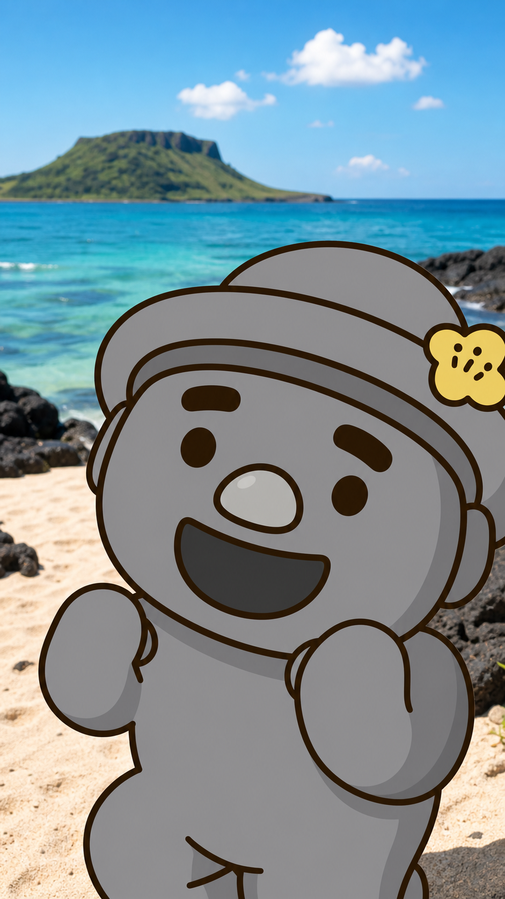
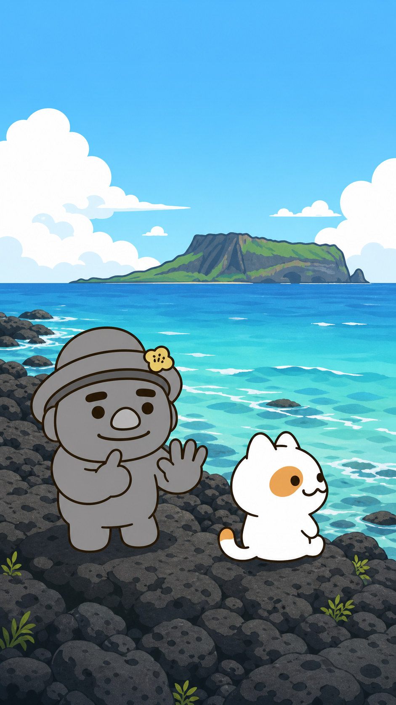
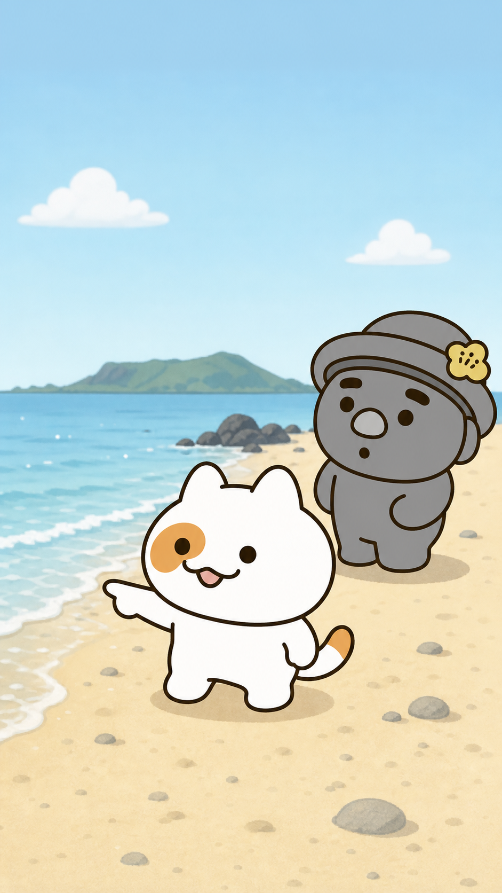
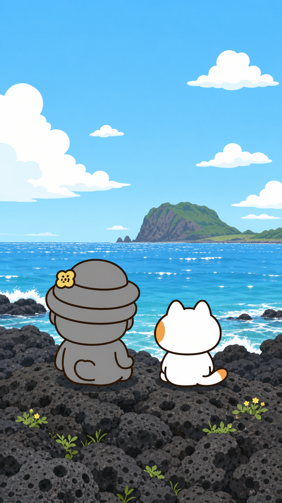

# 스토리보드 B안 — 코미디형

## 연출 방향

- 연출 콘셉트: 고르방의 끊이지 않는 수다와 냥냥이의 한마디를 빠른 리듬으로 대비한다.
- 목표 감정: 웃음, 가벼운 반전
- 총 길이: 30초
- 장면 수: 4

| 장면 | 시간 | 화면 구성 | 캐릭터 행동·표정 | 대사·자막 | 카메라 | 효과음·음악 | 생성 프롬프트 |
|---|---:|---|---|---|---|---|---|
| 1 | 0~3초 | 고르방의 들뜬 얼굴을 빠르게 보여 준다. | 고르방이 바다를 향해 손을 뻗으며 말문을 연다. | 고르방 “휴가 계획은 무려…” | 빠른 줌인 클로즈업 | 짧은 팡 / 경쾌한 연주 | 공식 고르방 외형을 정확히 유지한 세로 9:16 클로즈업. 뒤로 기운 모자와 노란 유채꽃, 둥근 눈썹, 큰 코, 회색 돌하르방 몸체. 제주 바다 배경, 텍스트·로고 없음. |
| 2 | 3~10초 | 고르방의 손동작과 냥냥이의 무심한 표정을 한 프레임에 대비한다. | 고르방은 손가락으로 길게 셀 듯 말하고, 냥냥이는 파도만 본다. | 고르방 “첫째, 둘째, 셋째…” / “수다 모드 ON” | 급한 미디엄 팬 | 톡톡톡 / 유머 연주 | 공식 고르방과 냥냥이의 외형·키 비례를 유지한다. 고르방은 더 크게, 냥냥이의 좌측 눈 주황 반점과 꼬리 끝 1/5 주황 무늬 고정. 해안의 파도, 텍스트 없음. |
| 3 | 10~19초 | 냥냥이의 담담한 얼굴과 고르방의 멈춘 표정을 번갈아 강조한다. | 냥냥이가 파도를 가리키고 고르방이 입을 다문다. | 냥냥이 “조용한 게 제일이다냥.” / “…” | 냥냥이 클로즈업 후 고르방 리액션 컷 | 효과음 끊김, 파도 | 냥냥이의 화면 기준 좌측 눈 반점이 명확한 공식 3/4 클로즈업. 고르방은 뒤쪽에서 놀란 표정, 외형 변화 없음. 제주의 바다와 현무암, 텍스트·말풍선 없음. |
| 4 | 19~30초 | 조용해진 두 캐릭터를 멀리서 보여 주며 작은 웃음으로 끝낸다. | 고르방은 속삭이듯 말하고 냥냥이는 만족스럽게 앉아 있다. | 고르방 “그래… 이게 진짜 휴가구나.” | 갑자기 넓어지는 와이드 샷 | 파도·바람 / 짧고 잔잔한 마무리 | 공식 외형·비례 유지. 밝은 낮의 제주 바다, 현무암 위에 나란히 앉은 고르방과 냥냥이, 고르방이 더 큰 키, 새 의상·소품 없음, 텍스트·로고·워터마크 없음. |

## 장면별 이미지 보드

### 장면 1 · 00:00~00:03

- 스토리: 고르방의 수다 모드가 빠르게 시작된다.
- 이미지 생성 기록: OpenAI built-in image generation / 공식 페이지 03, 05, 07, 11~13, 17~19 참조.

### 장면 2 · 00:03~00:10

- 스토리: 계획을 세는 고르방과 휴식에 집중하는 냥냥이를 대비한다.

### 장면 3 · 00:10~00:19

- 스토리: 냥냥이의 짧은 한마디가 수다를 멈춘다.

### 장면 4 · 00:19~00:30

- 스토리: 둘은 결국 조용한 바다를 함께 즐긴다.
