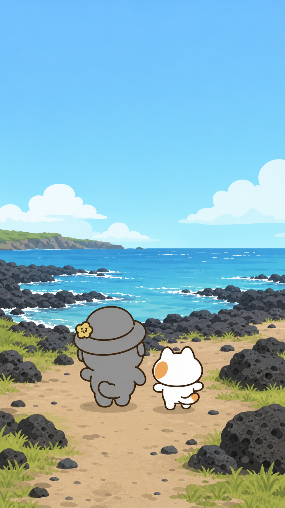
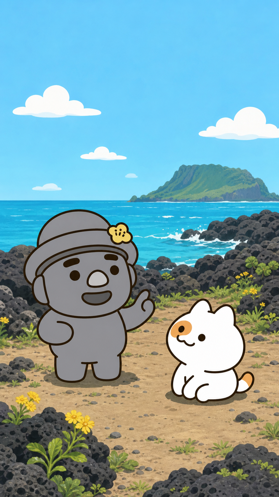
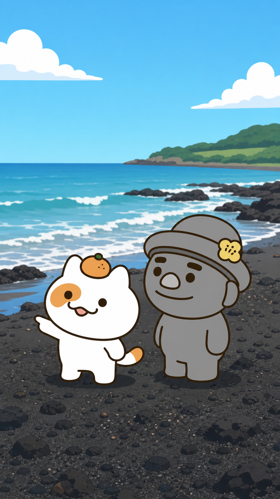
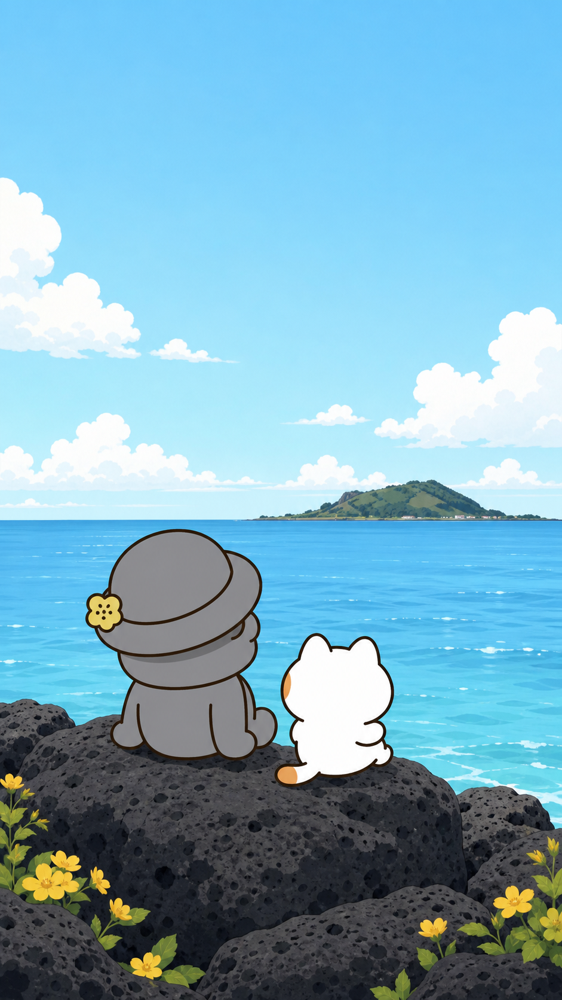

# 스토리보드 C안 — 감성형 / 세계관 확장형

## 연출 방향

- 연출 콘셉트: 제주 자연과 고르방·냥냥이의 편안한 관계를 넓은 화면과 여백으로 보여 준다.
- 목표 감정: 시원함, 따뜻함, 휴식
- 총 길이: 30초
- 장면 수: 4

| 장면 | 시간 | 화면 구성 | 캐릭터 행동·표정 | 대사·자막 | 카메라 | 효과음·음악 | 생성 프롬프트 |
|---|---:|---|---|---|---|---|---|
| 1 | 0~7초 | 넓은 제주 해안과 두 캐릭터의 작은 실루엣. | 함께 해안을 걸어 바다 앞에 멈춘다. | 자막 “제주 바다로 온 두 친구” | 천천히 팬하는 와이드 샷 | 바람·파도 / 감성 어쿠스틱 | 공식 고르방과 냥냥이의 외형과 정확한 키 비례. 세로 9:16, 넓은 제주 검은 현무암 해안과 맑은 하늘, 두 캐릭터는 안전 영역 하단 중앙, 새 의상·소품·텍스트 없음. |
| 2 | 7~15초 | 파도 하이라이트와 고르방의 옆모습. | 고르방이 바다 이야기를 다정하게 시작하고 냥냥이는 귀 기울인다. | 고르방 “파도 소리를 듣고 있으면 말이지…” | 고르방을 따라가는 느린 3/4 팬 | 파도 / 따뜻한 연주 | 고르방 공식 옆모습 규칙: 모자 기울기는 뒤쪽, 귀는 중심보다 약간 뒤, 코에 볼륨. 냥냥이는 더 작고 좌측 눈 반점·꼬리 무늬 유지. 낮빛, 텍스트 없음. |
| 3 | 15~23초 | 냥냥이의 시선 뒤로 바다가 길게 펼쳐진다. | 냥냥이가 파도를 가리키며 짧게 말한다. | 냥냥이 “조용한 게 제일이다냥.” | 느린 줌아웃 | 파도·가벼운 바람 | 공식 냥냥이 외형, 좌측 눈 주황 반점이 화면 기준 좌측, 꼬리 끝 1/5 주황. 고르방은 더 큰 키로 곁에서 조용히 듣는다. 자연스러운 제주 바다, 텍스트·말풍선 없음. |
| 4 | 23~30초 | 두 캐릭터와 수평선의 여백을 넓게 잡는다. | 고르방과 냥냥이가 나란히 앉아 바다를 바라본다. | 고르방 “그래, 쉼표 같은 휴가구나.” / “함께 쉬는 여름” | 뒤쪽 와이드 샷, 부드러운 페이드 | 파도·바람 / 잔잔한 마무리 | 공식 외형·비례 유지. 밝은 낮, 현무암 위에 나란히 앉은 두 캐릭터와 넓은 제주 수평선, 고르방이 더 큼, 새 의상·소품 없음, 텍스트·로고·워터마크 없음. |

## 장면별 이미지 보드

### 장면 1 · 00:00~00:07

- 스토리: 제주 바다의 넓은 풍경 속에 두 캐릭터가 도착한다.
- 이미지 생성 기록: OpenAI built-in image generation / 공식 페이지 03, 05, 07, 11~13, 17~19 참조.

### 장면 2 · 00:07~00:15

- 스토리: 고르방의 다정한 이야기가 파도 소리와 이어진다.

### 장면 3 · 00:15~00:23

- 스토리: 냥냥이가 휴식의 의미를 짧게 건넨다.

### 장면 4 · 00:23~00:30

- 스토리: 두 캐릭터의 조용한 여름 휴가가 완성된다.
